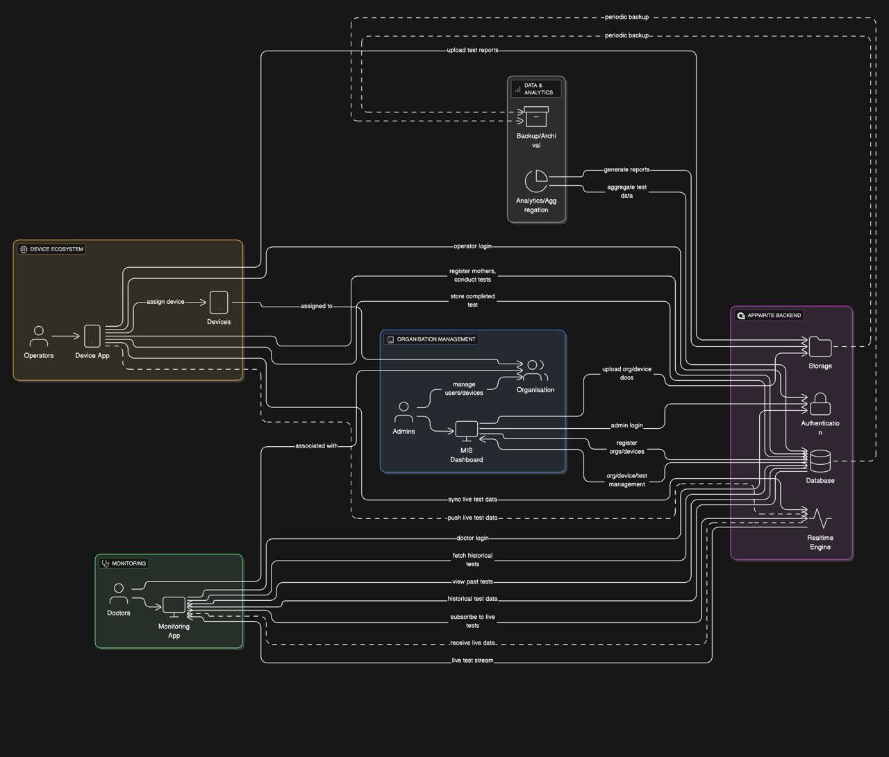

#  Fetosense MIS (Flutter Web + Appwrite)

[](https://discord.gg/aTBs7mCWgK)
[](LICENSE)
[](https://github.com/CareNX-Innovations-Pvt-Ltd/fetosense-web-flutter/commits/main/)
[](https://github.com/CareNX-Innovations-Pvt-Ltd/fetosense_device_flutter/issues)
[](https://codecov.io/gh/CareNX-Innovations-Pvt-Ltd/fetosense-web-flutter)

Fetosense MIS is a web-based Management Information System built with **Flutter Web** and **Appwrite**, designed to manage organizational data, devices, doctors, and mothers efficiently in healthcare settings.

> 🛠️ This web app is linked with the [Fetosense Device App](https://github.com/CareNX-Innovations-Pvt-Ltd/fetosense_device_flutter) and the [Fetosense Remote App](https://github.com/CareNX-Innovations-Pvt-Ltd/fetosense_remote_flutter).

---

##  Tech Stack

- **Flutter SDK**: `>=3.7.0 <4.0.0`
- **Backend**: [Appwrite](https://appwrite.io/)
- **Packages Used**:
  - [`appwrite`](https://pub.dev/packages/appwrite)
  - [`fl_chart`](https://pub.dev/packages/fl_chart)
  - [`qr_flutter`](https://pub.dev/packages/qr_flutter)
  - [`excel`](https://pub.dev/packages/excel)
  - [`path_provider`](https://pub.dev/packages/path_provider)
  - [`permission_handler`](https://pub.dev/packages/permission_handler)
  - [`intl`](https://pub.dev/packages/intl)
  - [`dropdown_button2`](https://pub.dev/packages/dropdown_button2)
  - [`font_awesome_flutter`](https://pub.dev/packages/font_awesome_flutter)

---

##  Folder Structure

```
lib/
├── screens/               # All main UI screens (login, dashboard, registration, etc.)
│   ├── dashboard_screen.dart
│   ├── device_details_page.dart
│   ├── organization_details_page.dart
│   ├── generate_qr_page.dart
│   └── ...
├── services/              # Backend service helpers
│   ├── auth_service.dart
│   └── excel_services.dart
├── utils/                 # Utility functions (API calls, formatting)
│   ├── fetch_devices.dart
│   ├── format_date.dart
│   └── ...
├── widget/                # Reusable UI components
│   ├── custom_date_picker.dart
│   └── organization_dropdown.dart
└── main.dart              # App entry point & route configuration
```

---

##  Getting Started

###  Prerequisites

- Flutter 3.7 or above
- Dart SDK
- Chrome browser (or any browser that supports Flutter Web)

###  Installation

```bash
git clone https://github.com/CareNX-Innovations-Pvt-Ltd/fetosense-web-flutter.git
cd fetosense_mis
flutter pub get
flutter run -d chrome
```

> Make sure you have Chrome installed and `flutter doctor` shows no issues.

---

##  Features

- Secure login and registration using Appwrite
- Register and manage hospitals/organizations
- Register and manage Doppler/Tablet devices
- Generate QR codes for kits
- Dashboard with charts and insights
- Export data to Excel
- Manage doctors and mothers (patients)
- Filter by custom date ranges
- Fully responsive Flutter Web UI

---

##  Developers Documentation

You can find the complete developer documentation [<u>here</u>](https://carenx-innovations-pvt-ltd.github.io/fetosense-web-flutter/).

---
## System Architecture Diagram



---

##  Project Charter

You can find the Project Charter [<u>here</u>](https://github.com/CareNX-Innovations-Pvt-Ltd/fetosense-web-flutter/blob/main/Fetosense%20Project%20Charter%20-%20UNICEF.pdf).

---

##  Testing

```bash
flutter test
```
---

##  Deployment

This project can be deployed using:
- Firebase Hosting
- GitHub Pages (via `flutter build web`)
- Appwrite Cloud Static Hosting
- Any web server (Nginx, Netlify, etc.)

---

##  Contributing

1. Fork the repository
2. Create your feature branch (`git checkout -b feature/amazing-feature`)
3. Commit your changes (`git commit -m 'Add some amazing feature`)
4. Push to the branch (`git push origin feature/amazing-feature`)
5. Open a Pull Request

---

##  About Fetosense

Fetosense is an innovative fetal monitoring solution. This MIS portal complements the solution by offering efficient backend tools to manage healthcare operations, device deployments, and patient insights.

---

## 💬 Join Our Discord Community

Have questions, feedback, or want to contribute?  
Join our official **Discord server** to connect with developers, collaborators, and contributors:

[](https://discord.gg/aTBs7mCWgK)

> 💡 Whether you're here to report bugs, suggest features, or just say hi — we’d love to have you!